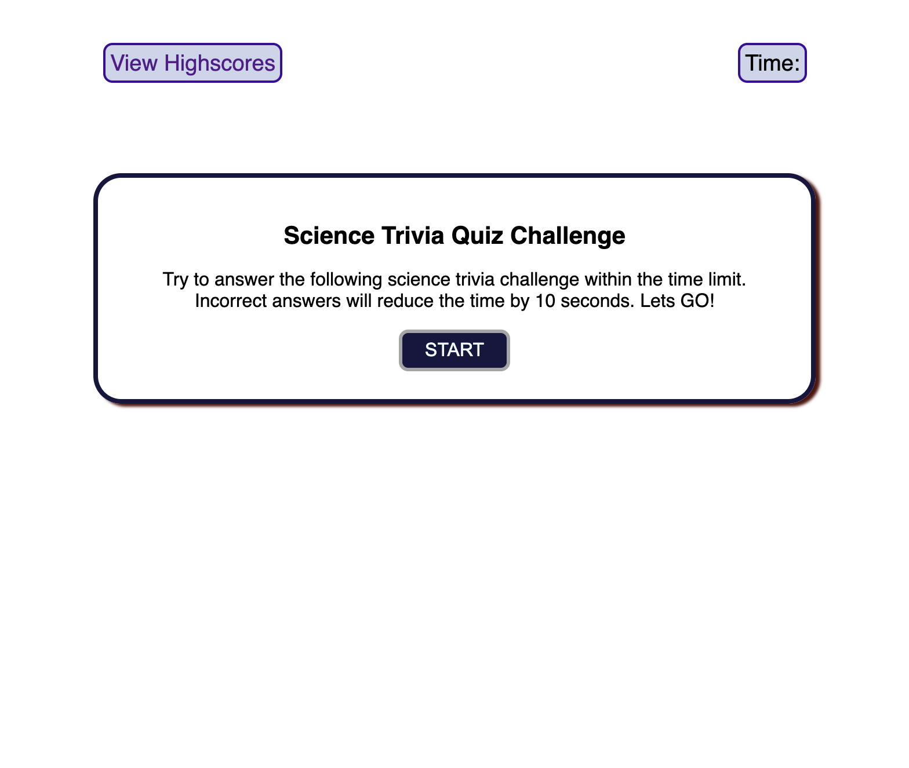
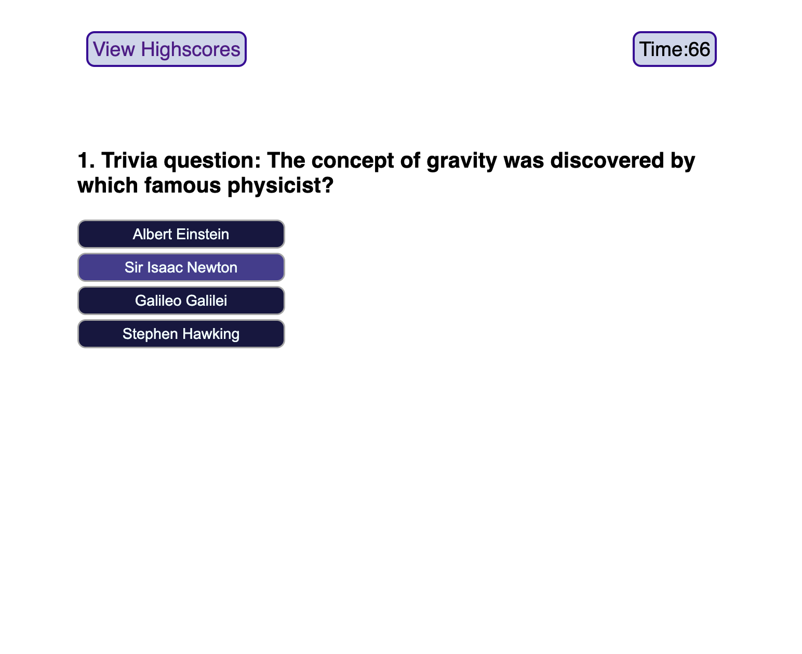

# science-trivia-challenge

## Description
The goal if this project is to create a science trivia quiz. The quiz containes a series of questions and multiple choice answers. The quiz is times using a setInterval function, and it decreases by ten seconds if an answer is wrong. The final score is the remaining time and it is stored in the local storage. The scores can be viewed in the highscore page.

## Link to webpage

## Installation

N/A

## Usage

This is science trivia quiz website. It displays a series of five questions and allows users to click on multiple choice buttons. The selected answer is checked and feedback is provides. A timer begins at the start of the quiz and for each wron answer, the time decrases by 10 seconds. scores are stored and displayed in local storage, which can be viewed in a highscore page.

## Credits

* Source of the questions
https://www.rd.com/list/science-trivia-questions/
-Suzanne Downing

## License

This project uses the MIT license.

## Badges

## Features

- Has a starting page with a start button.
- Explains rules and introduces to the science trivia quiz
- Allows users to click on buttons to select an answer.
- Validates user responses and provides feedback.
- Displays result as "correct" or "wrong" when the button is pressed.
- displays timer and score.
- users can store score in local storage and view is later.

